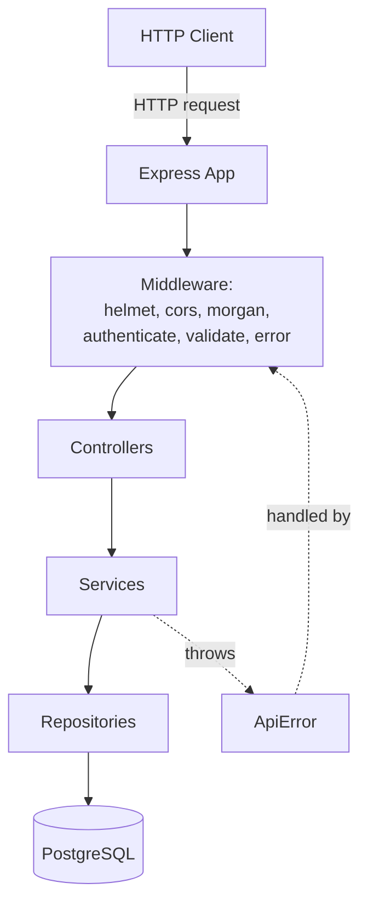
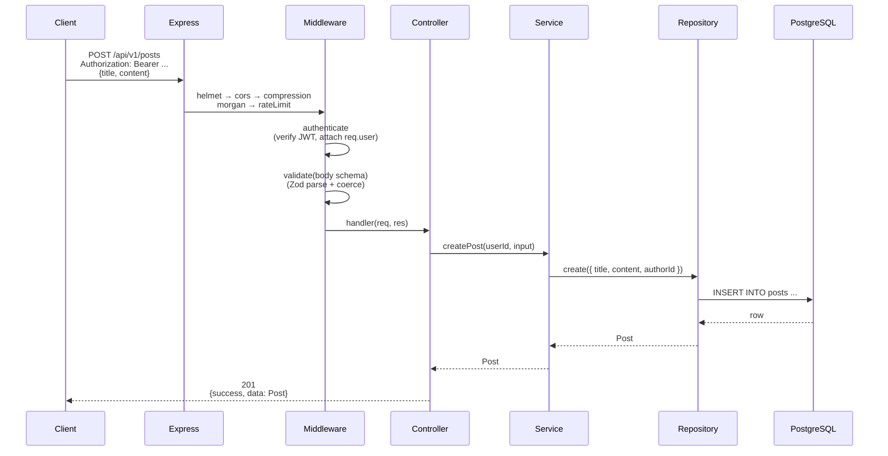
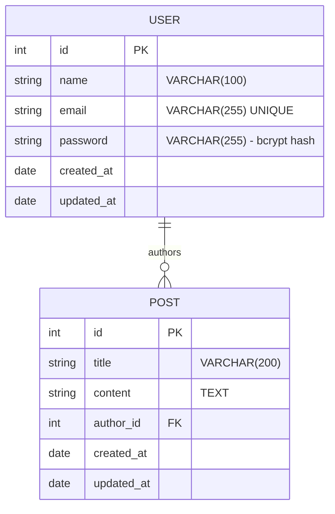
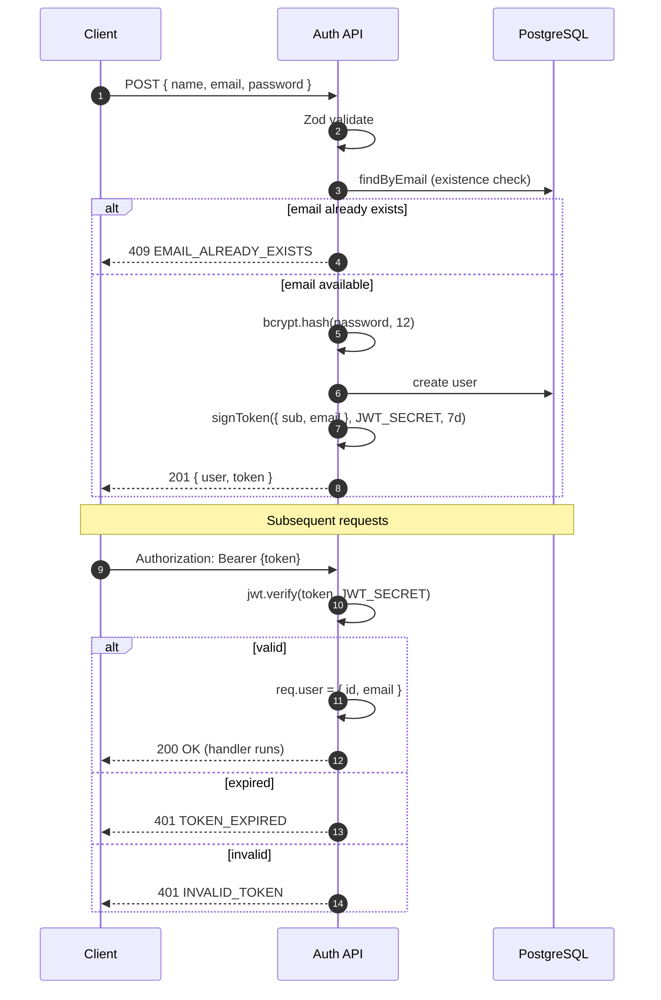

# Personal Blogging Platform API

> A production-grade RESTful API for a personal blogging platform — secure, documented, tested, and deployed to Vercel.

**🚀 [Live demo on Vercel →](https://meta-software-intern-task.vercel.app)**
**📚 [Interactive Swagger UI →](https://meta-software-intern-task.vercel.app/api/docs)**

[](https://nodejs.org)
[](https://www.typescriptlang.org)
[](https://expressjs.com)
[](https://www.prisma.io)
[](https://www.postgresql.org)
[](https://vercel.com)
[](LICENSE)

---

## Table of contents

- [Live demo](#live-demo)
- [Overview](#overview)
- [Features](#features)
- [Architecture](#architecture)
- [Request lifecycle](#request-lifecycle)
- [Database schema](#database-schema)
- [Auth flow](#auth-flow)
- [Project structure](#project-structure)
- [Quick start](#quick-start)
- [Environment variables](#environment-variables)
- [Endpoints](#endpoints)
- [Error response shape](#error-response-shape)
- [API documentation](#api-documentation)
- [Tests](#tests)
- [Deployment to Vercel](#deployment-to-vercel)
- [npm scripts](#npm-scripts)
- [Security notes](#security-notes)
- [License](#license)

---

## Live demo

The API is deployed on Vercel with a Neon-hosted Postgres:

| URL | What it serves |
|---|---|
| <https://meta-software-intern-task.vercel.app/api/v1/health> | Liveness probe |
| <https://meta-software-intern-task.vercel.app/api/v1/posts> | Public list of posts |
| <https://meta-software-intern-task.vercel.app/api/docs> | **Interactive Swagger UI** — click "Try it out" to hit the live API |
| <https://meta-software-intern-task.vercel.app/api/docs.json> | Raw OpenAPI 3.0.3 spec |

The OpenAPI spec is configured with a **relative server URL** (`/api/v1`), so the Swagger UI's "Try it out" button always targets the origin you're loading it from — no hardcoded production URL, no CORS surprises.

## Overview

This API lets users register, log in, and manage their own blog posts. Posts are publicly listable; write operations require the user to be authenticated and (for update/delete) to be the post's owner.

It's designed to demonstrate a clean, layered backend with strict type safety, validation, ownership enforcement, comprehensive tests, interactive API documentation, and a one-click Vercel deploy.

---

## Features

- **Authentication** — bcrypt-hashed passwords, JWT-based session tokens, ownership-scoped authorization
- **CRUD on posts** — public list (with pagination) and get; authenticated create / update / delete
- **Validation** — Zod schemas at the HTTP boundary, with field-level error details
- **Security** — Helmet headers, CORS allow-list, rate limiting on auth endpoints, parameterized queries
- **Documentation** — self-hosted Swagger UI at `/api/docs`, raw OpenAPI spec at `/api/docs.json`, Postman collection in `docs/`
- **Tests** — 29 tests across unit + integration suites, run against a real Postgres
- **CI** — GitHub Actions runs lint / typecheck / test / build on every push and PR
- **Deploy** — `vercel.json` ready; one click to deploy on Vercel with a hosted Postgres

---

## Architecture

The codebase follows a clean layered architecture. Dependencies point inward: outer layers (Express) depend on inner layers (services, repositories, domain), and the inner layers never import from the outer.



**Layer responsibilities**

| Layer | Lives in | Responsibility |
|---|---|---|
| Middleware | `src/middlewares/` | Auth, validation, logging, error handling, 404 |
| Controllers | `src/modules/*/*.controller.ts` | Parse HTTP request, call service, format response |
| Services | `src/modules/*/*.service.ts` | Business rules, ownership checks, error throwing |
| Repositories | `src/modules/*/*.repository.ts` | Database queries (one place where Prisma is touched) |
| Shared | `src/shared/` | Cross-cutting utilities (errors, logger, types) |
| Config | `src/config/` | Env validation, Prisma client, Swagger spec |

**Dependency rule:** controllers never query the DB directly. Services never import Express. Repositories never return HTTP types. This makes every layer testable in isolation.

---

## Request lifecycle

A typical authenticated request flows through the chain below. Every step is short, focused, and testable in isolation.



For an error, the controller's thrown `ApiError` bubbles through `asyncHandler` → `next()` → the central `errorHandler` middleware → a standardized JSON error envelope.

---

## Database schema

Two entities, one relationship. The `posts.author_id` column has `ON DELETE CASCADE` so deleting a user removes their posts. The unique index on `users.email` is what makes the duplicate-email check fast and correct at the database level.



`posts.author_id` is also indexed (besides the PK) so "my posts" queries are index seeks rather than full scans.

---

## Auth flow

Register and login are the only endpoints that mint a JWT. Subsequent requests include it in the `Authorization` header; `authenticate` middleware verifies it on every protected request.



Login uses the same error message for "no such email" and "wrong password" so the API doesn't leak which accounts exist.

---

## Project structure

```
.
├── api/                                Vercel serverless entry
│   └── index.ts                        exports the Express app
├── prisma/
│   ├── schema.prisma                   User + Post data model
│   ├── migrations/                     SQL migrations (committed)
│   └── migration_lock.toml             Locks migration format
├── prisma.config.ts                    Prisma 7 client config (datasource.url)
├── src/
│   ├── app.ts                          Express composition (no listen)
│   ├── server.ts                       Local bootstrap (listen, graceful shutdown)
│   ├── routes.ts                       Module router aggregator
│   ├── config/                         Env, Prisma client, Swagger
│   ├── middlewares/                    authenticate, validate, error, notFound
│   ├── modules/
│   │   ├── auth/                       auth.controller / service / routes / schema
│   │   ├── posts/                      post.controller / service / routes / schema / repository
│   │   └── users/                      user.repository
│   └── shared/
│       ├── errors/                     ApiError, errorCodes
│       ├── types/                      express.d.ts, api.ts
│       └── utils/                      asyncHandler, password, token, logger
├── tests/
│   ├── setup.ts                        NODE_ENV=test bootstrap
│   ├── helpers/                        db, test-app
│   ├── unit/                           password, token
│   └── integration/                    auth, posts
├── docs/
│   └── postman_collection.json         Postman v2.1 import
├── .github/
│   ├── workflows/ci.yml                GitHub Actions pipeline
│   └── dependabot.yml                  Weekly dep updates
├── vercel.json                         Vercel deploy config
├── docker-compose.yml                  Local Postgres 16 service
├── jest.config.js
├── tsconfig.json                       Base (IDE + tests + ts-jest)
├── tsconfig.build.json                 Production build (src/ only, rootDir: ./src)
├── .eslintrc.cjs
├── .prettierrc.json
├── package.json
└── README.md
```

---

## Quick start

### Prerequisites

- **Node.js 20+** (`node --version` to check)
- **npm 10+** (bundled with Node 20+)
- **Docker** (recommended) for the local Postgres, **or** any reachable PostgreSQL 14+ instance

### Local setup

```bash
# 1. Clone
git clone https://github.com/<your-username>/Meta-Software-Intern-Task.git
cd Meta-Software-Intern-Task

# 2. Install dependencies
npm install

# 3. Copy the env template and edit the values you need to change
cp .env.example .env

# 4. Start Postgres (Docker is the fastest path)
docker compose up -d

# 5. Apply migrations
npm run db:migrate -- --name init   # first time only
# or, for subsequent runs:
npm run db:deploy

# 6. Start the dev server (hot-reload via tsx)
npm run dev
```

The API is now reachable at `http://localhost:3000`:

| URL | What it serves |
|---|---|
| `http://localhost:3000/api/v1/health` | Liveness probe |
| `http://localhost:3000/api/v1/auth/register` | Create a user |
| `http://localhost:3000/api/v1/auth/login` | Log in, get a JWT |
| `http://localhost:3000/api/v1/posts` | Public list / authenticated create |
| `http://localhost:3000/api/docs` | Interactive Swagger UI |
| `http://localhost:3000/api/docs.json` | Raw OpenAPI 3.0.3 spec |

### Sanity check

```bash
# Should return {"success":true,"data":{"status":"ok"}}
curl http://localhost:3000/api/v1/health

# Register a user
curl -X POST http://localhost:3000/api/v1/auth/register \
  -H 'Content-Type: application/json' \
  -d '{"name":"Jane","email":"jane@example.com","password":"correct-horse-battery-staple"}'
```

---

## Environment variables

| Variable | Required | Default | Description |
|---|---|---|---|
| `NODE_ENV` | no | `development` | One of `development`, `production`, `test` |
| `PORT` | no | `3000` | HTTP listen port (local only) |
| `DATABASE_URL` | **yes** | — | PostgreSQL connection string |
| `JWT_SECRET` | **yes** | — | Symmetric secret for signing JWTs. Min 32 chars. |
| `JWT_EXPIRES_IN` | no | `7d` | JWT lifetime (e.g. `1h`, `7d`, `30d`) |
| `BCRYPT_SALT_ROUNDS` | no | `12` | bcrypt cost factor (4–15) |
| `CORS_ORIGIN` | no | `http://localhost:3000` | Comma-separated origin allow-list |
| `RATE_LIMIT_WINDOW_MS` | no | `900000` (15 min) | Rate limit window for `/auth/*` |
| `RATE_LIMIT_MAX` | no | `10` | Max requests per window per IP |
| `LOG_LEVEL` | no | `info` | winston level (`error`, `warn`, `info`, `debug`, …) |

**Production safety nets built into `env.ts`:**

- The app **refuses to start** if any required variable is missing or has an obviously bad value.
- The app **refuses to start in production** if `JWT_SECRET` is still the placeholder from `.env.example`.

See `.env.example` for a documented template.

---

## Endpoints

All paths are prefixed with `/api/v1`. Auth columns: **Public** = no JWT required, **Bearer** = `Authorization: Bearer <jwt>` required, **Owner** = additionally requires the post to belong to the caller.

### Auth

| Method | Path | Auth | Body | Success | Notes |
|---|---|---|---|---|---|
| `POST` | `/auth/register` | Public | `{ name, email, password }` | `201 { user, token }` | Returns 409 on duplicate email |
| `POST` | `/auth/login` | Public | `{ email, password }` | `200 { user, token }` | Returns 401 for unknown email *or* wrong password (same message) |

### Posts

| Method | Path | Auth | Body / Query | Success | Notes |
|---|---|---|---|---|---|
| `GET` | `/posts` | Public | `?page=1&limit=10&authorId=N` | `200` paginated list | Newest first; `limit` capped at 100 |
| `GET` | `/posts/:id` | Public | — | `200` post with author | `404 POST_NOT_FOUND` if missing |
| `POST` | `/posts` | Bearer | `{ title, content }` | `201` post | Author = `req.user.id` |
| `PUT` | `/posts/:id` | Owner | `{ title?, content? }` (at least one) | `200` post | `403 NOT_POST_OWNER` if not author |
| `DELETE` | `/posts/:id` | Owner | — | `204` no content | `403 NOT_POST_OWNER` if not author |

### Health

| Method | Path | Auth | Success | Notes |
|---|---|---|---|---|
| `GET` | `/health` | Public | `200 { status: 'ok' }` | Liveness probe for uptime monitors |

---

## Error response shape

Every error from any endpoint — validation, auth, ownership, rate limit, internal — flows through one central handler and comes out in the same shape:

```json
{
  "success": false,
  "error": {
    "code": "VALIDATION_ERROR",
    "message": "Validation failed",
    "details": {
      "email": ["Invalid email format"],
      "_form": ["At least one of title or content must be provided"]
    }
  }
}
```

Common codes: `VALIDATION_ERROR`, `UNAUTHORIZED`, `INVALID_TOKEN`, `TOKEN_EXPIRED`, `INVALID_CREDENTIALS`, `EMAIL_ALREADY_EXISTS`, `FORBIDDEN`, `NOT_FOUND`, `POST_NOT_FOUND`, `NOT_POST_OWNER`, `CONFLICT`, `RATE_LIMIT_EXCEEDED`, `ROUTE_NOT_FOUND`, `INTERNAL_ERROR`.

---

## API documentation

Three ways to explore the API:

1. **Swagger UI** (interactive, hosted by this app):
   `http://localhost:3000/api/docs`
2. **Raw OpenAPI 3.0.3 spec** (machine-readable):
   `http://localhost:3000/api/docs.json`
3. **Postman collection** (offline, importable):
   `docs/postman_collection.json`

The Postman collection auto-captures the JWT into a collection variable on register/login, so the protected requests work out of the box with no manual copy-paste.

---

## Tests

```bash
npm test              # run all tests once
npm run test:watch    # re-run on change
npm run test:coverage # generate coverage report (HTML + lcov)
```

The suite contains **29 tests** across 4 files:

| File | Type | Coverage |
|---|---|---|
| `tests/unit/password.test.ts` | Unit | bcrypt hash + compare, salt randomness |
| `tests/unit/token.test.ts` | Unit | JWT sign + verify, secret & payload validation |
| `tests/integration/auth.test.ts` | Integration | register, login, duplicate, validation, email normalisation |
| `tests/integration/posts.test.ts` | Integration | list, get, create, update, delete, ownership, pagination |

Integration tests run against a real Postgres (the local Docker one, or the service container in CI). Each test cleans the `users` and `posts` tables in `beforeEach` so they're independent.

The `auth` rate limiter is **skipped in test mode** (gated on `env.NODE_ENV !== 'test'` in `app.ts`) so a single file can hit register many times without tripping the limit.

---

## Deployment to Vercel

Vercel auto-detects the `api/` directory and wraps `api/index.ts` with its `@vercel/node` builder. The `vercel.json` at the project root adds a catch-all rewrite so every URL routes to the same function.

### One-time setup

1. **Push to GitHub** (the CI workflow on commit 13 needs this).
2. **Import the repo in Vercel** — visit [vercel.com/new](https://vercel.com/new) and pick the repo. Vercel auto-detects the `vercel.json` and uses the `vercel-build` script.
3. **Set environment variables** in the Vercel project settings (these are never committed):
   - `DATABASE_URL` — a hosted Postgres URL. **Free options**: [Vercel Postgres](https://vercel.com/docs/storage/vercel-postgres), [Neon](https://neon.tech), [Supabase](https://supabase.com).
   - `JWT_SECRET` — generate a long random string:
     ```bash
     node -e "console.log(require('crypto').randomBytes(64).toString('hex'))"
     ```
   - `NODE_ENV` — set to `production`.
4. **Apply migrations** against the hosted DB. Easiest: run `npm run db:deploy` locally with the hosted `DATABASE_URL` in your shell, or use the Prisma migration tooling of your provider.

### What Vercel does on every push to `main`

1. Runs `npm run vercel-build` → `prisma generate && tsc -p tsconfig.build.json`
2. Auto-detects `api/index.js` and serves it at `/api`
3. Routes every request (`/(.*)`) to that single function
4. The function runs the Express app, which connects to your hosted Postgres

### Caveats

- **Serverless connection pooling**: Prisma's driver adapter pattern (used here) means each cold function instance creates a new Prisma client + connection. For higher traffic, put a connection pooler in front (e.g. Neon's built-in pooler, or PgBouncer on Supabase).
- **Cold starts**: first request after idle takes ~1–2s. Subsequent warm requests are fast.

---

## npm scripts

| Script | What it does |
|---|---|
| `npm run dev` | Start the dev server with `tsx watch` (hot reload) |
| `npm run build` | Compile TypeScript to `dist/` (uses `tsconfig.build.json`) |
| `npm start` | Run the compiled server (requires `npm run build` first) |
| `npm run typecheck` | Type-check `src/` and `tests/` (uses the main `tsconfig.json`) |
| `npm run lint` | ESLint over `src/` and `tests/` |
| `npm run lint:fix` | Auto-fix what's fixable |
| `npm run format` | Prettier write |
| `npm run format:check` | Prettier check |
| `npm test` | Run the full Jest suite once |
| `npm run test:watch` | Re-run on change |
| `npm run test:coverage` | Coverage report (HTML + lcov) |
| `npm run db:migrate` | `prisma migrate dev` (development) |
| `npm run db:deploy` | `prisma migrate deploy` (CI / production) |
| `npm run db:reset` | Drop & re-apply all migrations (destructive) |
| `npm run db:studio` | Open Prisma Studio in the browser |
| `npm run db:generate` | Regenerate the Prisma Client (run after `schema.prisma` changes) |
| `npm run vercel-build` | The build command Vercel runs (`prisma generate && tsc`) |

---

## Security notes

- **Passwords** are hashed with bcrypt at cost factor 12 (OWASP recommended). Plaintext is never stored or logged.
- **JWTs** are signed with HS256 using a 32+ char secret. The token contains `{ sub: <userId>, email }`; the `sub` claim is intentionally a number, not a string, for ergonomic server-side handling (documented as a deliberate RFC 7519 deviation in `src/shared/utils/token.ts`).
- **Authorization** is enforced in the service layer (`post.service.ts`'s `assertOwned` helper) rather than middleware, so every code path that mutates a post is checked. There is no way to bypass it without changing the service.
- **Rate limiting** on `/api/v1/auth/*` defaults to 10 requests / 15 minutes / IP — enough to develop against, low enough to slow brute force.
- **Input validation** runs before any controller code (Zod via the `validate` middleware). Malformed bodies never reach the service.
- **Error messages** don't leak whether an email is registered (login returns the same `Invalid email or password` for both "no such email" and "wrong password").
- **Helmet** sets secure default headers (X-Content-Type-Options, X-Frame-Options, Strict-Transport-Security, etc.).
- **CORS** is allow-list based. `*` is only the default in development; tighten `CORS_ORIGIN` in production.
- **Prisma** parameterizes every query — no SQL injection vector.
- **The placeholder JWT_SECRET in `.env.example` is rejected at boot in production** by `env.ts`. The app will not start with the default value when `NODE_ENV=production`.

---

## License

[MIT](LICENSE) — Abanoub Saweris, 2026.
